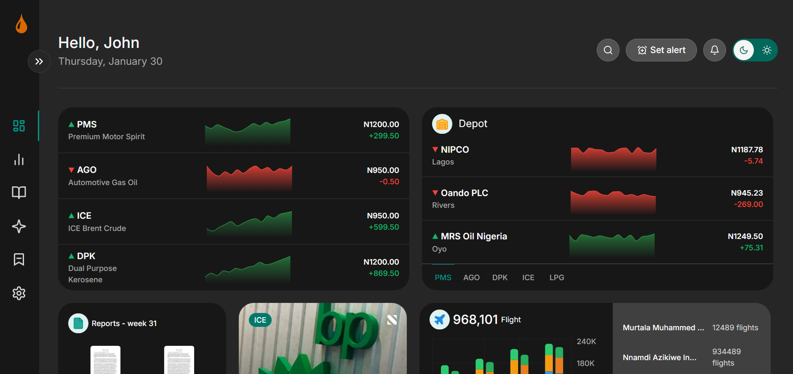

# PetroData

PetroData is a web application built with Next.js and React to visualize petroleum product price fluctuations across different depots.



## 🚀 Live Demo

[PetroData on Vercel](https://petrodata-basit.vercel.app/)

## 📌 Features

- Displays price variations for different petroleum products.
- Uses `recharts` for interactive data visualization.
- Styled with Tailwind CSS for a responsive UI.

## 🛠️ Tech Stack

- **Framework**: Next.js 14
- **UI Library**: React 18
- **Charts**: Recharts
- **Styling**: Tailwind CSS

## ⚙️ Installation & Setup

1. Clone the repository:
   ```sh
   git clone https://github.com/yourusername/petrodata.git
   cd petrodata
   ```
2. Install dependencies:
   ```sh
   npm install
   ```
3. Run the development server:
   ```sh
   npm run dev
   ```
4. Open `http://localhost:3000` in your browser.

## 📜 Scripts

- `npm run dev` - Runs the app in development mode.
- `npm run build` - Builds the production version.
- `npm run start` - Starts the production server.
- `npm run lint` - Lints the code for errors.

## 📌 Any assumptions or design decisions you made

Used mock data to work on the charts

## 📄 License

This project is for assessment purposes and is not open-source.
